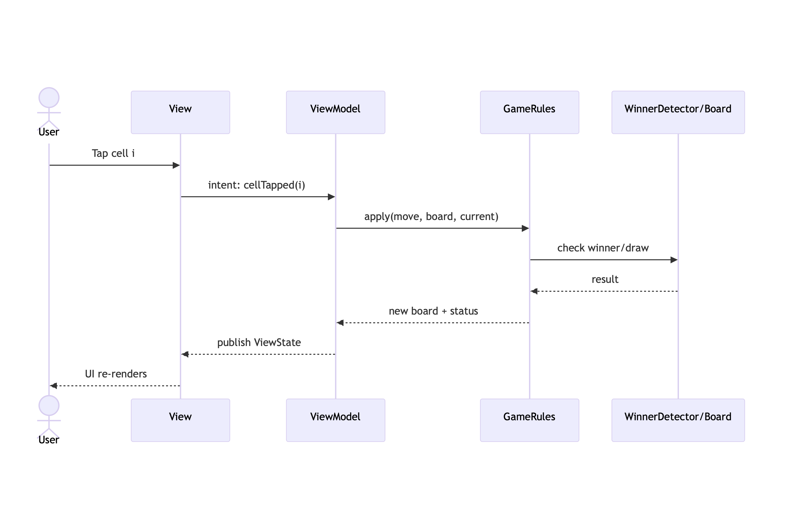

# TicTacToe (SwiftUI)

A modern SwiftUI implementation of Tic-Tac-Toe with a clean separation between **UI (app)** and **domain logic (GameCore via SPM)**.

## Quick Start

1. **Open in Xcode**: Double‑click the `.xcodeproj`
2. **Resolve SPM packages**: Xcode → File → Packages → Reset Package Caches (if needed) → Resolve.
3. **Run**: Select an iOS simulator
4. **If `import GameCore` fails**:
   - Ensure the package is added via **File → Add Packages…** (use the Git URL if hosted, otherwise Local).
   - In your **App target → General → Frameworks, Libraries & Embedded Content**, ensure the `GameCore` **product** is linked.
## Modules

- **App (SwiftUI)**: Views, ViewModels, composition.
- **GameCore (Swift Package)**: Board state, rules, winner/draw detection, pure functions.
## Architecture

- **Pattern**: SwiftUI + MVVM. Views are a function of state; `ViewModel` orchestrates intent and binds to `GameCore` APIs.
- **Boundary**: UI does not re‑implement rules. Domain stays in **GameCore** for reuse and testability.
- **DI**: Protocol‑first boundaries for engines/services to keep ViewModels testable.

## How This Project Teaches Fundamentals

- **SRP**: Each type has one reason to change (e.g., `Board`, `Move`, `Rules`).
- **OCP**: Extend with optional variants (e.g., board size) without modifying stable logic.
- **DIP**: UI depends on `GameCore` abstractions (protocols), not concrete types.
- **Immutability**: Favor value types for board/moves; pure functions for rule checks.
- **Testability**: Deterministic rule engines; small public surface for assertions.

## Roadmap & Improvements

- Animations, haptics, and accessibility labels.
- Optional board sizes (3×3 default → 4×4+ variants via GameCore strategies).
- Local multiplayer → simple AI → difficulty levels.
- Snapshot tests for UI states.
  
## Contributing

- Keep domain logic in **GameCore**.
- Add/extend features via protocols and small types.
- Prefer pure functions for rule checks and game state transitions.
- Write/extend tests for every rule or bug fix.

## sequenceDiagram

  

  

